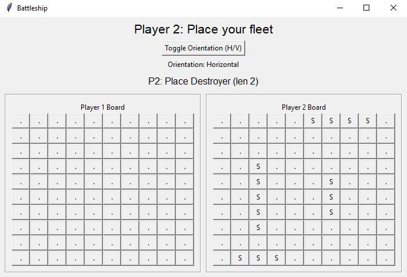
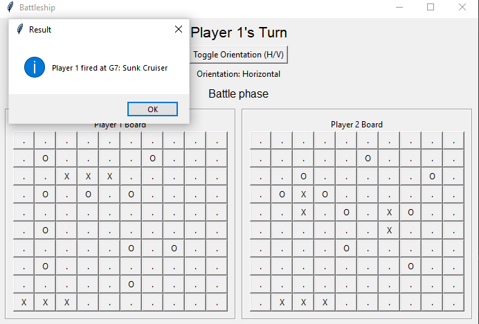
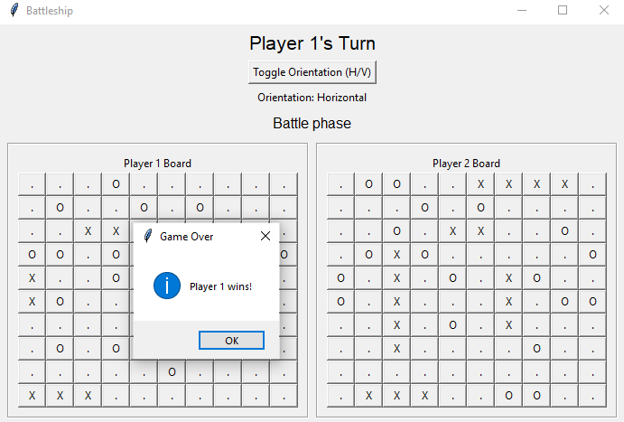

# Battleship Game 🎮🚢

A two-player **Battleship game** built in **Python** with a **Tkinter GUI**.  
This was my **first full project**, combining object-oriented programming, game logic, and a graphical interface.

---

## Features ✨
- Classic **Battleship rules**: players place fleets and take turns firing at coordinates.
- **Manual ship placement** with orientation toggle (Horizontal/Vertical).
- **Fog of war**: during battle, players only see their hits (`X`) and misses (`O`) on the enemy board.
- Real-time updates of boards after each move.
- Clear win condition: the game announces when a player’s fleet has been completely sunk.
- Built fully in **Python**, no external libraries except Tkinter.

---

## Fleet Setup ⚓
Each player has the standard fleet:
- Carrier (length 5)  
- Battleship (length 4)  
- Cruiser (length 3)  
- Submarine (length 3)  
- Destroyer (length 2)  

---

## How to Play 🎲
1. Each player takes turns **placing their fleet** (Carrier, Battleship, Cruiser, Submarine, Destroyer).  
2. Click on your board to place ships, toggle orientation with the button.  
3. Once both players are ready, the **battle phase** begins.  
4. Players take turns firing at coordinates on the opponent’s board.  
   - `X` = hit  
   - `O` = miss  
5. The game ends when all ships of one player are sunk.

---

## Screenshots 📸

### Placement Phase  
Players place their fleets manually.  


### Battle Phase  
Players take turns firing shots at the opponent’s board.  


### Game Over  
The game announces the winner when all ships are sunk.  


---

## Future Improvements 🚀
- Add single-player mode with a simple AI opponent.  
- Improve the GUI with better visuals (colors, ship icons, animations).  
- Add sound effects for hits, misses, and sunk ships.  
- Allow players to customize fleet size and rules.  
- Online multiplayer support.  

---

## License 📜
This project is licensed under the MIT License — feel free to use, modify, and share.  
See the [LICENSE](LICENSE) file for details.

---

## How to Run ▶️
1. Clone this repo:
   ```bash
   git clone https://github.com/blazej-wiz/Battleship-Game.git
   cd Battleship-Game

